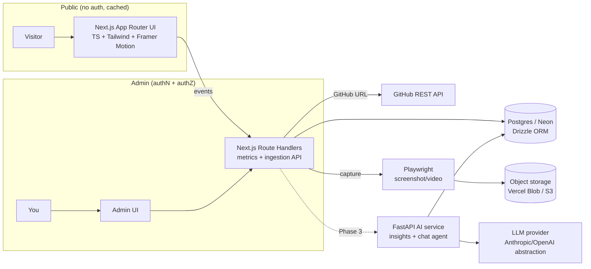

# Architecture Direction: Timeline Portfolio + Interaction Metrics + AI

## 1. Goal
Ship a portfolio site that (a) reads as a vertical scroll-timeline, (b) is a live proof of elite frontend engineering (TypeScript, React, Next.js), and (c) grows a Python/AI backend that lets visitors interact with projects and turns those interactions into tracked, analyzable metrics. Admin (you) can add projects from a GitHub link and get previews; public visitors need no login.

The strategy is **ship a beautiful frontend in week 1, then layer backend/AI without a rewrite.** Every phase deploys and stands on its own.

## 2. Context I Am Assuming
- **Confirmed:** One engineer (you). Frontend showcase is the priority. Python is desired for AI later. Timeline UX with a center line, scrollable, paginated. GitHub-link project ingestion + hover preview. Admin-vs-public split. You'll implement in Cursor.
- **Assumed:** Solo admin (just you), low-to-moderate traffic, Vercel is acceptable for v1 hosting, most "projects" are web apps with a deployable demo URL. Budget-sensitive (free tiers first).
- **Unknown / decide below:** How real the hover "preview" must be (recorded video vs live iframe vs sandboxed build). Whether AWS hosting is required now for learning, or can wait until the Python service exists.

## 3. Requirements
### Functional
- Vertical timeline: center line, alternating cards, oldest→newest top→bottom, smooth scroll, paginated/lazy-loaded (not one giant page).
- Project card: title, dates, stack, description, GitHub link, live-demo link, hover preview.
- Add project via GitHub URL → auto-pull metadata → generate preview → publish.
- Admin auth for add/edit; public read with no auth.
- Track interactions: view, hover-preview, demo-open, outbound-click, dwell time.
- Later: AI over the interaction data ("which projects resonate", auto-summaries, a "chat with my portfolio" agent).

### Non-functional
- **Performance:** Public pages static/cached, fast LCP, no auth on the hot path.
- **Security:** authN ≠ authZ; admin writes gated; never run untrusted repo code on your infra in v1.
- **Operability:** One-command local dev, preview deploys per PR, observable events.
- **Cost:** Free tier through Phase 2.
- **Maintainability:** Typed end-to-end, schema-driven, no premature microservices.

## 4. Recommended Architecture
A **Next.js "modular monolith"** first: the frontend and the metrics/write API live in one typed Next.js app. Introduce a **separate Python FastAPI service only when AI arrives** — not before. This avoids the classic solo-dev trap of building microservices you then have to babysit, while still ending at a multi-service architecture you can defend in an interview.



## 5. Component Breakdown
| Component | Responsibility | Technology Choice | Why |
|---|---|---|---|
| Web UI | Timeline, cards, animations, admin forms | Next.js 15 App Router + TypeScript + Tailwind + shadcn/ui + Framer Motion | Fastest path to an *elite-looking* frontend; App Router = server components + streaming |
| Metrics/Ingestion API | Record events, ingest GitHub projects | Next.js Route Handlers | No second service to run in Phase 2; typed with the UI |
| DB | Projects + append-only events | PostgreSQL (Neon serverless) + Drizzle ORM | Skill default; Drizzle is TS-first and lighter than Prisma |
| Auth | Admin login only | Auth.js (NextAuth v5), GitHub OAuth + email allowlist | One admin, OAuth = no password storage; middleware enforces authZ |
| Preview generator | Screenshot/short video of a demo URL | Playwright (in a route handler or scheduled job) | Reliable, safe, no arbitrary code execution |
| Object storage | Preview media | Vercel Blob (v1) → S3 (Phase 3) | Zero-config early; S3 for AWS learning later |
| AI service | Insights, summaries, "chat with portfolio" | Python FastAPI + provider abstraction | Python where AI belongs; separate service = real backend to showcase |
| Analytics (optional) | Free product analytics | PostHog or Plausible | Instant funnels while your own events table matures |

## 6. Data Flow
**Public view:** Visitor loads timeline (static/ISR) → hovers a card → client fires a lightweight `POST /api/events` (view/hover/demo-open) → route handler validates + appends to `events` table. No auth, non-blocking, fire-and-forget.

**Add a project (admin):** Paste GitHub URL → `POST /api/projects` (auth required) → server calls GitHub REST API for name/description/README/languages/stars/topics → optionally triggers Playwright capture of the demo URL → stores media in Blob → inserts `project` row → revalidates the timeline.

**AI (Phase 3):** Nightly/async job or on-demand → FastAPI reads `events` + `projects` → produces aggregates + LLM insights → writes back to an `insights` table → Next.js reads it. "Chat with my portfolio" hits FastAPI, which does RAG over your project data.

## 7. Stack Recommendation
### Good enterprise default
Next.js 15 + TS + Tailwind + shadcn/ui + Framer Motion; Neon Postgres + Drizzle; Auth.js; Playwright previews; Vercel Blob; PostHog. FastAPI + Anthropic/OpenAI (behind a provider interface) on AWS ECS/Fargate in Phase 3.

### Simpler MVP version
Same frontend, but **projects as typed MDX/content files** (no DB yet), preview = a recorded `.webm` you drop in `/public`, no auth, deploy to Vercel. This gets a stunning live portfolio in days. Add DB + auth + events the moment you want dynamic add/metrics.

### What to avoid for now
- Building/running arbitrary GitHub repos in sandboxed containers on your infra (huge security + ops cost — this is "build your own Vercel").
- Kubernetes. Use Vercel, then ECS/Fargate.
- A separate Python service before there's actual AI work for it to do.
- Knowledge graph / Neo4j — a relational schema is plenty here.

## 8. Tradeoffs
| Decision | Benefit | Cost / Risk | When to revisit |
|---|---|---|---|
| Next.js monolith before FastAPI | One deploy, ship fast, typed end-to-end | Less "microservices" flex early | When AI/heavy analytics justify a second service (Phase 3) |
| Vercel first, AWS later | Best Next.js DX, free, preview deploys | Less AWS learning now | When FastAPI ships → put it on ECS/Fargate + RDS + S3 |
| Preview = recorded media / iframe, not live build | Safe, cheap, reliable | Not "runs any repo live" | If you truly need in-browser code execution → StackBlitz WebContainers / Sandpack (their infra, not yours) |
| MDX content → DB later | Days to a live portfolio | A migration step later | The day you want to add projects without a deploy |
| Drizzle over Prisma | Lighter, TS-native, SQL-close | Smaller ecosystem than Prisma | Only if you hit a Prisma-only tool |

## 9. Security, Reliability, Observability
- **Auth/authz:** Auth.js handles authN. AuthZ is a *separate* middleware check (`isAdmin(email)` against an allowlist) on every write route — never infer "logged in" as "allowed."
- **Secrets:** `.env.local` locally, Vercel/host env vars in prod. Never commit. GitHub token + LLM keys server-side only.
- **Logging/metrics/tracing:** Structured logs in route handlers; your own `events` table is your product metric; add OpenTelemetry when FastAPI lands.
- **Auditability:** Admin writes go to an append-only `audit_log` (who, what, when). Skill rule: admin features get audit logs.
- **Failure handling:** Event writes are fire-and-forget (never block the UI). GitHub/Playwright ingestion runs in a try/catch with a "draft/failed" project state you can retry — don't let a bad repo URL 500 the admin panel. Rate-limit `/api/events`.
- **Untrusted input:** Treat every pasted GitHub URL as hostile — validate host is `github.com`, never `eval`, never execute repo code.

## 10. Implementation Plan
### Phase 1 — Timeline frontend (this week)
Next.js + TS + Tailwind + Framer Motion. Center-line timeline with alternating cards and a scroll-driven line-draw. Projects from typed MDX/content. Hover preview from a recorded `.webm`. Deploy to Vercel. **Outcome: a live, gorgeous portfolio.**

### Phase 2 — Dynamic + metrics
Add Neon Postgres + Drizzle; migrate projects to DB. Auth.js admin login + allowlist. Admin "add via GitHub URL" pipeline (GitHub API + Playwright capture). `events` table + `/api/events` + client hooks. Optional PostHog. **Outcome: you add projects without deploying; interactions are tracked.**

### Phase 3 — AI + AWS
FastAPI service (provider abstraction over Anthropic/OpenAI). Insights job over `events`. "Chat with my portfolio" via RAG on project data. Move the Python service to AWS ECS/Fargate, media to S3, DB to RDS, CI/CD in GitHub Actions, OTel traces. **Outcome: real multi-service, cloud, AI system to talk about in interviews.**

## 11. Cursor Prompts (copy-paste, one per step)

**P1 — Scaffold**
```
Create a Next.js 15 app (App Router, TypeScript, Tailwind, ESLint, src dir, @/* alias)
named "portfolio". Add shadcn/ui and framer-motion. Set up a clean folder structure:
src/app, src/components, src/content (MDX projects), src/lib. Add a typed Project schema
(zod): id, title, slug, startDate, endDate, stack[], languages[], summary, githubUrl, demoUrl,
and a discriminated `preview` union keyed on previewType
(webapp|cli|service|library|notebook|media) carrying the right payload per type.
Create 3 sample projects as MDX spanning different previewTypes. No backend yet.
```

**P2 — Timeline UI**
```
Build a vertical timeline component. A center SVG line runs top-to-bottom; project cards
alternate left/right. Use framer-motion useScroll to animate the line drawing as the user
scrolls, and fade/slide each card in on enter (IntersectionObserver or motion whileInView).
Oldest project at top. Load projects lazily/paginated so it's not one huge DOM. Cards show
title, dates, stack chips, summary, GitHub + demo links. Fully responsive; collapse to a
single left-aligned rail on mobile. Prioritize polish: spacing, motion easing, dark mode.
```

**P3 — Preview system (v1, safe, multi-language)**
```
Projects span many languages, so make the Project type a discriminated union on `previewType`:
'webapp' | 'cli' | 'service' | 'library' | 'notebook' | 'media'. Each card renders a matching
<Preview> component on hover intent (lazy-loaded):
- webapp: muted looping <video> (webm) with poster fallback; "Open demo" opens demoUrl.
- cli: an asciinema/terminal cast player (or a looping terminal webm) with poster.
- service: a compact request/response sample + link to Swagger/OpenAPI; optional short webm.
- library: syntax-highlighted usage snippet (Shiki) rendered server-side.
- notebook: a rendered output image/chart with a link to the full notebook.
- media: screenshots/gallery for mobile/desktop/game captures.
All previews honor prefers-reduced-motion and only load on hover. No preview executes repo code.
```

**P4 — DB + admin (Phase 2)**
```
Add Neon Postgres with Drizzle ORM. Define tables: projects, events (append-only:
id, projectId, type, ts, sessionId, meta jsonb), audit_log. Migrate MDX projects into the DB
and read the timeline from Drizzle with ISR. Add Auth.js (NextAuth v5) with GitHub OAuth.
Implement authZ SEPARATELY: an isAdmin(email) allowlist checked in middleware on all /admin
and write routes. Public routes stay open and cached.
```

**P5 — GitHub ingestion**
```
Build an admin page + POST /api/projects (auth required). Input: a GitHub URL. Validate host
is github.com. Server-side, call the GitHub REST API for name, description, README, languages,
stars, topics; map into the Project schema as a draft. Then (best-effort, in try/catch) run
Playwright to capture a screenshot + short webm of demoUrl, store in Vercel Blob, attach to the
project. Write an audit_log row. Never execute repo code. Failures leave the project in "draft".
```

**P6 — Metrics**
```
Add POST /api/events (rate-limited, no auth) that validates and appends events. Add a small
client hook useTrack() that fires view/hover/demo-open/outbound-click events fire-and-forget
(navigator.sendBeacon), with a per-visitor sessionId in a cookie. Build a protected /admin
dashboard that aggregates events per project (views, hovers, demo opens, CTR) from Drizzle.
```

## 11b. Preview system for mixed-language projects (supersedes the earlier web-app assumption)
Your projects span many languages, so "run a live preview on hover" is only true for deployable web apps. The honest, elite-frontend answer is a **typed, polymorphic preview system** — the card declares what kind of thing it is and renders the right primitive:

| previewType | What it is | Preview primitive (safe) | Optional upgrade |
|---|---|---|---|
| `webapp` | Deployable web app | Auto-captured looping webm + poster; "Open demo" → live URL | Live iframe of demo; Sandpack for JS/TS source |
| `cli` | Command-line tool | asciinema/terminal cast or looping terminal webm | — |
| `service` | Backend/API | Request→response sample + OpenAPI/Swagger link | Short-lived read-only demo endpoint |
| `library` | Package/lib | Server-rendered syntax-highlighted usage snippet (Shiki) | Runnable example via Sandpack/StackBlitz (JS/TS) |
| `notebook` | Data/ML | Rendered output chart/image + link to full notebook | Embedded Colab/HF Space link |
| `media` | Mobile/desktop/game | Screenshot gallery or screen-recording webm | — |

**Capture pipeline (Phase 2):** for `webapp`, Playwright (via the Playwright MCP or a job) auto-generates the screenshot + webm from `demoUrl` when you add the project. For non-web types, you attach the terminal cast / snippet / notebook output at add-time. The key invariant holds across all types: **you never execute untrusted repo code on your infra** — previews are generated media, embeds, or someone else's sandbox (Sandpack/WebContainers). This makes the "runs any repo live" instinct real *only* where it's safe, and gracefully honest everywhere else.

## 12. What You Should Learn From This
- **Sequence complexity, don't front-load it.** A monolith that ships beats microservices that don't. You *earn* the second service when AI gives it a job.
- **authN ≠ authZ.** "Logged in" and "allowed" are different checks; keep them separate or you'll ship an admin bug.
- **Never run untrusted code on your infra.** The "live preview" instinct is right; the safe implementation is recorded media / iframes / someone else's sandbox (WebContainers), not your own build farm.
- **Your events table is a product.** Append-only, fire-and-forget, and it becomes the fuel for the AI phase.

## Interview talking points
- "I built a modular monolith and split out a Python AI service only when the workload justified it — here's the tradeoff table."
- "Ingestion treats every GitHub URL as untrusted; previews are generated media, so I never execute third-party code."
- "Metrics are an append-only event stream, which let me add AI insights later without schema churn."

## Open questions before you start
1. **Preview fidelity:** recorded video (recommended v1) / live iframe of the demo / true in-browser code (WebContainers, later)?
2. **Hosting:** Vercel now with AWS in Phase 3 (recommended), or do you want AWS from day one for learning?
3. **Demo URLs:** do most of your projects have a deployed URL to capture/iframe, or are some CLI/backend-only (which changes what "preview" means for them)?