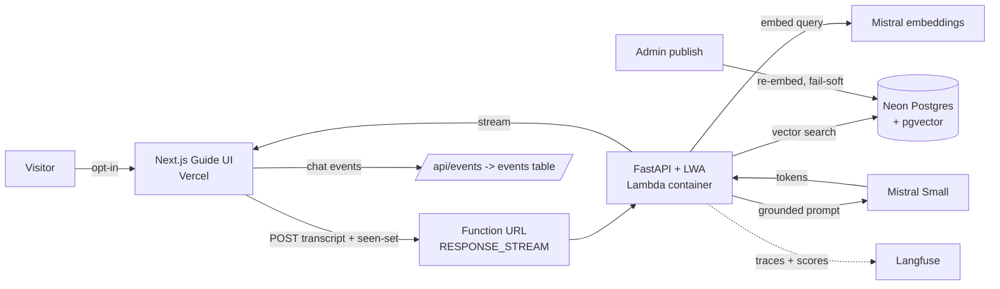

# Architecture Direction: Phase 3 — AI Guide (RAG + Agent)

> Status: **SCOPED, not started.** Phase 2 complete and deployed.
> Read alongside `docs/HANDOFF.md` (state + locked decisions) and `docs/DEPLOY.md` (deploy ritual).

---

## 1. Goal

A visitor-facing **intelligent guide** on the portfolio: opt-in, grounded in Writam's own corpus
(projects, skills, about-me), streaming fast answers, citing its sources by scrolling the timeline
to the project it drew from. It tracks what a visitor has already seen and suggests what to look at
next, while letting them redirect at any time.

**Why this justifies a Python service** (the honest version): streaming chat alone does *not* — a
Next.js route handler with an SDK would do it. The split earns itself on **evaluation, tracing, and
state-machine agent orchestration**, which are Python-native and not worth reimplementing in
TypeScript. That means the eval harness and traceability are **load-bearing justification for the
phase**, not post-scope garnish. Drop them and the case for the service collapses.

**Terminology discipline:** this is a modular monolith with **one extracted service**, not
microservices. The locked ship-order said the FastAPI service enters only when AI gives it a real
job. That condition is now met. In an interview, *"I extracted an inference service when the
workload justified it and kept everything else in the monolith"* is a stronger answer than
"microservices" — it demonstrates knowing when **not** to split.

---

## 2. Context I Am Assuming

**Confirmed**
- Phase 2 live in prod: DB-driven timeline (Neon + Drizzle), Auth.js v5 admin boundary, GitHub
  ingestion, anonymous events + dashboard, visitor card (Resend), one canonical preview shape.
- `events` table: indexed `ts`, indexed `(projectId, ts)`, **no FK** (archival-friendly), written
  via the `neon-serverless` Pool, anonymous, ephemeral per-page-load `session_id`.
- MDX is the **permanent** rich-authoring path (ingestion can't author rich previews).
- Vercel Blob is **out** of the stack (no consumer).
- Provider/model: **Mistral Small** via La Plateforme.
- Deploy target: **Lambda container** (scale-to-zero), not ECS/Fargate.
- IaC: **Terraform**. Repo: **monorepo**, independently deployed service.
- Tracing: **Langfuse**. Orchestration: **LangGraph**.
- Skills + about-me authored as **MDX**.
- Re-embed on publish: **automatic + fail-soft + manual reindex escape hatch**.
- Agent is **opt-in** per visitor.
- **pgvector IS supported on Neon** (verified July 2026) — enabled via `CREATE EXTENSION vector`,
  no dashboard toggle, no tier gate. The brute-force-cosine fallback is dead; Slice 1 keeps its shape.
  **Put `CREATE EXTENSION IF NOT EXISTS vector;` in the migration**, not a hand-run SQL Editor step —
  the extension must land on `dev`, `test`, **and `main`**, and the migration ritual (incl. the
  deliberate `main` step in `docs/DEPLOY.md`) is the machinery that guarantees that. A manual
  `CREATE EXTENSION` is exactly what gets applied to dev and forgotten on `main` — the failure that
  has already bitten this project twice.

**Confirmed — frontend groundwork already landed (pre-Phase-3, zero Phase 3 code)**
- **IA restructure:** `/` = landing (Static + 1h ISR, build-resilient featured strip), `/projects` =
  the timeline (Static + 1h ISR), `/skills` = MDX-driven (Static). Shared sticky nav with an
  **intentional slot for the opt-in guide widget**.
- **`/projects#<slug>` deep-link scroll EXISTS AND IS TESTED** — pagination-aware, force-mounts past
  the page window, instant under reduced motion. This is the Phase 3 **citation-scroll contract**:
  Slice 5 wires to a proven target instead of building the citation surface and its caller at once.
- Skills + about authored as MDX with stable slugs → `{type:'skill',slug}` / `{type:'bio'}` need no
  re-authoring.
- **`pnpm corpus:check`** exists (`scripts/corpus-check.mjs`): scans `src/content/about` +
  `src/content/skills` for the `{/* @placeholder … */}` marker (an MDX JSX comment — invisible in
  render, detectable in raw source) and hard-fails naming offenders. Deliberately **not** wired into
  `next build`. All 11 corpus files are currently marked, so it fails by design today.

**Assumed**
- Corpus is small (~5–20 projects + skills + bio ≈ low thousands of tokens) and changes rarely.
- Traffic is near-zero and bursty (recruiters, not users). Every visitor hits a cold Lambda.
- Conversation state is per-visit; nothing persists across refresh.

**Unknown — verify before Slice 1**
- Langfuse deployment shape (free cloud vs self-host).
- Exact Mistral free-tier rate limits (no longer published; check Admin Console → Limits).

---

## 3. Requirements

### Functional
- Visitor opts in; guide streams grounded answers about projects/skills/Writam.
- Answers carry **citations**; project citations scroll the timeline to that node.
- Guide tracks a **seen-set** and suggests a next item; visitor may redirect freely.
- Out-of-scope questions are **declined**, not answered.
- Chat interactions land in `events` and surface on the admin dashboard.
- Admin can trigger a **manual reindex**; index staleness is visible in `/admin`.

### Non-functional
- **Latency:** streaming TTFB is the metric. Cold start is on the critical path for ~every visitor.
- **Cost:** hard ceiling. An unauthenticated LLM endpoint is a stranger's budget.
- **Groundedness:** the agent must not misrepresent Writam. This outranks uptime.
- **Privacy:** no visitor identity, no cookies, no IP retention. Consistent with Phase 2.
- **Operability:** every answer traceable end-to-end; evals runnable on demand.
- **Cost of idle:** ~$0. Nothing runs when nobody is asking.

---

## 4. Recommended Architecture

Next.js (Vercel) owns the guide UI and proxies to the service. A **stateless** FastAPI container on
Lambda owns retrieval, orchestration, tracing, and the Mistral call. Neon holds both the relational
data and the vector index. Conversation state lives **on the client** and is sent each turn.

**Why stateless.** LangGraph's default answer is a checkpointer persisting state in Postgres/Redis
keyed to a visitor — which is exactly the identity Phase 2 deliberately refused to mint. Instead the
client holds the transcript + seen-set and replays it each turn; the Lambda reconstructs graph state
per request. The ephemeral `session_id` already dies on refresh, so the conversation dying with it
is **consistent, not a limitation**.

**The cost of that choice:** client-supplied state is **untrusted input** and a prompt-injection
vector (a forged "assistant" turn). Bounded by: the system prompt lives server-side and is never
client-overridable; hard caps on transcript length and turn count (also the cost control — a long
forged history is expensive tokens); the seen-set arrives as **project IDs validated against known
projects**, never free text. Worst case: someone talks the agent into something odd *to themselves*,
on their own rate-limit allotment. Acceptable blast radius.

---

## 5. Component Breakdown

| Component | Responsibility | Technology | Why |
|---|---|---|---|
| Guide UI | Opt-in widget, streaming render, citation → scroll-to-node, seen-set tracking | Next.js 15 + existing shadcn primitives | Owns presentation; already owns the timeline it scrolls |
| Function URL | Public streaming entrypoint | Lambda Function URL, `InvokeMode: RESPONSE_STREAM` | Lambda's native streaming path; API Gateway not needed |
| Web adapter | Lets FastAPI stream on a Python runtime | **Lambda Web Adapter** (`AWS_LWA_INVOKE_MODE: RESPONSE_STREAM`) | Lambda streams natively only on Node.js runtimes. **Mangum buffers — it will not stream.** One `COPY --from` line + env var |
| Agent service | Retrieval, graph orchestration, prompt, tracing | FastAPI + LangGraph, container on Lambda (arm64) | Scale-to-zero; Python-native eval/trace ecosystem |
| Vector index | Chunk storage + similarity search | **pgvector on Neon** | Reuses existing Postgres. Corpus doesn't justify a dedicated vector DB — and saying so is a better answer than "I used Pinecone" |
| Embeddings | Query + corpus embedding | **Mistral embeddings API** | Bundling `sentence-transformers`/torch would balloon the image and dominate cold start. Deployment target dictates the ML design |
| Generation | Grounded answer | **Mistral Small**, **pinned model string** | Task is easy (retrieval does the work); small = faster + cheaper. `-latest` aliases silently upgrade and would invalidate eval baselines |
| Tracing/eval | Traces, scores, judge runs | **Langfuse** | Trace inspection + eval scoring in one; open-source lean |
| IaC | Lambda, ECR, Function URL, IAM, budget alarm | **Terraform**, `terraform apply` run manually | Stated default; the IaC is itself portfolio material. Manual apply keeps deploy a deliberate ritual — the Lambda never ships out from under you |
| Metrics | Chat interactions | existing `events` table + dashboard | Same table, indexes, anonymous posture, ephemeral session id. No new schema domain |

---

## 6. Data Flow

**Query path**
1. Visitor opts in (until then: **nothing calls Mistral** — no idle spend, no drive-by cold starts, no bot tokens).
2. UI POSTs `{ transcript, seenProjectIds, question, sessionId }` to the Function URL.
3. Lambda: bot filter → strict schema validation (reject unknown fields; cap turns + length) → rate limit (Upstash, per IP; IP transient, never stored) → **global daily spend check (fails closed)**.
4. Embed the query (Mistral embeddings) → vector search pgvector → top-k chunks.
5. LangGraph: route (guided-next vs. user-directed) → ground → generate, streaming tokens back via LWA.
6. Trace the whole turn to Langfuse (retrieved chunk ids, prompt, tokens, latency, cost).
7. UI renders tokens + citations; a project citation scrolls the timeline to that node; interaction fires to `/api/events`.

**Index path (two writers, one table)**
- **MDX chunks** → embedded at **build/deploy**. Corpus change and reindex are atomic in one commit.
- **Project chunks** → re-embedded **on publish**. `setProjectStatusWithAudit` already is a
  `requireAdmin()` server action that already fires `revalidatePath("/")`; it grows one bounded step.

**Why publish, not build.** Projects are mutable at runtime via admin ingest/publish. A purely
build-time index means a project appears on the timeline but the agent doesn't know it exists until
the next deploy — a silent, bad failure. Tying re-embed to publish keeps **publish the single moment
a project becomes public**: to the timeline *and* to the agent. One action, one meaning.

**Fail-soft, made visible.** The embed call must not block the publish — publish can't start failing
for reasons unrelated to publishing. But fail-soft without visibility is just silent failure. So:
`projects.index_status` (`indexed` | `stale` | `failed`) + `indexed_at`, surfaced in the `/admin`
list, with a **manual reindex** action (also `requireAdmin()`, also audit-logged). That's what makes
the escape hatch actionable rather than decorative.

---

## 7. Stack Recommendation

### Good enterprise default (what we're building)
FastAPI + LangGraph on Lambda (arm64 container) behind a Function URL with LWA response streaming;
Terraform; pgvector on Neon; Mistral Small (pinned) + Mistral embeddings; Langfuse; Upstash for
rate limiting; `events` for metrics.

### Simpler MVP version (what we are explicitly *not* doing, and why)
Stuff the whole corpus into the system prompt from a Next.js route handler. **This would work** —
the corpus fits in context. Be honest about why we're not: retrieval here is not for context-window
pressure, it's for **grounding and citation** — pointing at *which chunk* produced a claim is what
makes traces auditable and citations clickable. That is the defensible answer when an interviewer
asks "why RAG for 8k tokens?"

### What to avoid for now
Self-hosted weights. A dedicated vector DB. A live re-embedding pipeline (dead infra — the corpus
changes on publish, not per request). LangGraph checkpointers / server-side conversation state.
Provisioned concurrency (defeats scale-to-zero). Kubernetes. Reading `events` from the agent.

---

## 8. Tradeoffs

| Decision | Benefit | Cost / Risk | When to revisit |
|---|---|---|---|
| Lambda over Fargate | ~$0 idle; scale-to-zero | **Every visitor hits a cold start** (~1–3s before first token) — sparse traffic means always cold | If traffic becomes steady, or TTFB proves unacceptable |
| Streaming (LWA) | Bounds perceived cold-start; TTFB is the felt metric | Python needs LWA + Function URL; Mangum won't do it | Only if moving off Lambda |
| Client-held state | No visitor identity; consistent with Phase 2 privacy | Untrusted input; injection vector; caps required | If conversations must survive refresh (they shouldn't) |
| pgvector on Neon | No new dependency; one datastore | Not a specialized ANN engine | Corpus grows orders of magnitude |
| Mistral Small (pinned) | Fast, cheap, sufficient | Weaker synthesis than flagship | If eval scores show generation (not retrieval) is the failure |
| Mistral embeddings API | Tiny image, fast cold start | Network hop per query; provider lock at the embed layer | If cold start stops mattering |
| LangGraph | Justified: seen-set state + guided/redirect branching | Framework weight for a small graph | If the guide collapses to a straight line, drop it |
| Terraform (manual apply) | Portfolio artifact; deliberate deploys | Slower than SAM; AWS's LWA examples are SAM | Never — this is the point |
| Monorepo | One clone/PR; governance carries over | Vercel rebuilds on `service/**` pushes → use Ignored Build Step | If the service gets its own team |
| Re-embed on publish | Index can't silently lag | Publish depends on an external call → fail-soft + status + manual reindex | If publishes get slow |
| Opt-in agent | **Cost control**: zero spend from scrollers/bots | Fewer visitors engage | Never |

---

## 9. Security, Reliability, Observability

**The threat model shifts again.** Every prior public write path abused a counter (`events`) or an
inbox (contact). This one has a **per-request bill** and **can be talked into things**.

- **Cost.** Hard per-request token caps; transcript + turn caps; tight Upstash per-IP limits; and a
  **global daily spend ceiling that fails closed**. Per-IP limits do not stop distributed abuse from
  running up a bill. Back it with an AWS Budget alarm as the out-of-band tripwire.
- **Prompt injection.** The defense is **scope refusal**, not a cleverer prompt: the guide answers
  about Writam and his work and declines everything else. **Narrow scope is the control.** System
  prompt is server-side and never client-overridable.
- **Misrepresentation — the real business risk.** If it hallucinates 8 years of Kubernetes and a
  recruiter believes it, that is worse than any downtime in this project. **Groundedness is a
  correctness requirement**: every claim traceable to a retrieved chunk; *"I don't know"* is a
  first-class answer.
- **Auth/authz.** Function URL is public (`AuthType: NONE`) — the rate limiter and spend ceiling are
  the boundary. Admin reindex sits behind `requireAdmin()` at the resource, per the locked invariant.
- **Secrets.** `MISTRAL_API_KEY`, `LANGFUSE_*`, `DATABASE_URL` via Lambda env / SSM. Never in chat,
  never in the repo. Separate dev/prod keys — the OAuth-app split lesson.
- **Privacy.** No visitor identity, no cookie, no IP storage. Langfuse traces must not carry PII;
  visitor questions are the only user-authored content and stay scoped to the trace.
- **Provider data terms.** Mistral's free Experiment tier is explicitly for evaluation, not
  production, and free tiers may be used for training; data isolation / zero-retention is a
  commercial-tier property. A public guide *is* production traffic, and visitor questions are
  arguably theirs, not ours, to donate. **Move to pay-as-you-go before it goes public** — pennies at
  this traffic on Small.
- **Observability.** Langfuse traces every turn (retrieved chunk ids, prompt, tokens, latency, cost,
  judge scores). CloudWatch for cold-start and error rates. `index_status` surfaces staleness.
- **Failure handling.** Mistral down → honest error to the visitor, never a fake answer. Embed fails
  on publish → publish succeeds, `index_status = failed`, visible in admin, manual reindex available.
  Rate-limited/over-budget → opaque, and never confirms to an abuser what tripped.

---

## 10. Implementation Plan

**Ordering principle: prove the deploy path before the AI exists.** The Lambda + LWA + streaming +
Function URL + Terraform + ECR stack has more novel failure modes than the RAG does. Debugging a
cold-start streaming issue *and* a retrieval bug simultaneously is how a phase stalls.

### Phase 3 slices

| # | Slice | Substance | Model |
|---|---|---|---|
| 0 | **Pre-flight** | Mistral account + key. Langfuse project. AWS MCP **ON**, Figma **OFF** (tool-cap discipline). Vercel Ignored Build Step for `service/**`. **Write the real corpus** and get `pnpm corpus:check` to pass — see open question #4; this gates Slice 1. | — |
| 1 | **Corpus + index** | `CREATE EXTENSION IF NOT EXISTS vector` **in a migration** (dev + test; `main` at deploy per DEPLOY.md). One canonical **chunk schema** with a `source` discriminator (`project`\|`skill`\|`about`) and a **citation-target union** (`{type:'project',slug}` \| `{type:'skill',slug}` \| `{type:'bio'}`). pgvector table + build-time indexer, which **hard-fails on placeholder markers**. **No service yet.** | Opus |
| 2 | **Walking skeleton** | FastAPI + LWA container (arm64) on Lambda, Function URL `RESPONSE_STREAM`, ECR, IAM, budget alarm — all in Terraform. **Streams a hardcoded string. No AI.** Proves the hard infra. | Opus |
| 3 | **Retrieval + grounded answer** | Embed query → pgvector search → grounded prompt → stream. Citations returned. Langfuse tracing. Scope refusal. Rate limit + spend ceiling. | Opus |
| 4 | **LangGraph flow** | Guided next-suggestion, seen-set, user-directed redirect. Client-held state contract + validation. | Opus |
| 5 | **Guide UI** | Opt-in widget (drops into the **existing nav slot**), streaming render, **citation → scroll-to-timeline-node** (wires to the already-built + tested `/projects#<slug>` contract — do NOT rebuild it), chat events. Re-embed-on-publish + `index_status` + manual reindex in `/admin`. | Opus |
| 6 | **Eval harness + judge** | Golden cases (*"does it accurately represent Writam?"*), regression prompts, failure labels, LLM-as-judge scoring into Langfuse. **Not optional — this is the phase's justification.** | Opus |

Each slice: fresh Cursor chat → read `PROGRESS.md` first → Test Gate → update PROGRESS → **STOP**.
Slice 5's citation-scrolls-to-node is the demo that lands in an interview: groundedness made
**visible** rather than claimed.

### Deferred to Phase 4
Pipeline-driven migrations; retention/rollup of `events`; provisioned concurrency; custom domain for
the Function URL; multi-turn eval; screenshot-on-ingest (would resurrect Blob).

---

## 11. What Writam Should Learn From This

The transferable lessons, and the interview answers they buy:

1. **Extract a service when the workload justifies it — and be able to say what that workload is.**
   The Python service earns itself on eval/trace/agent tooling, not on "calling an LLM." Naming the
   real reason (and admitting streaming alone wouldn't justify it) is what separates an architect
   from someone following a diagram.
2. **The deployment target dictates the ML design.** Choosing Lambda is what rules out a bundled
   embedding model and rules in an embeddings API + pgvector. Infra and modelling are not separable
   concerns.
3. **Know which properties you bought and which you paid for.** Lambda buys ~$0 idle and costs a cold
   start on every visit. Streaming is the mitigation, not a feature.
4. **RAG over a tiny corpus is about grounding and citation, not context pressure.** Say that before
   an interviewer asks.
5. **Privacy posture propagates into architecture.** "No visitor identity" is what makes the Lambda
   stateless and the client the state-holder — and that in turn creates an injection surface that
   needs bounding. Constraints compose.
6. **Groundedness is correctness.** The worst failure here is not an outage, it's the agent lying
   about you. That's why the judge is load-bearing.
7. **Fail-soft requires visibility.** A soft failure you can't see is a silent failure. `index_status`
   is what turns a design principle into an operable system.
8. **Connect it back:** this is the same shape as NeuralERP/SAP integration work — an external system
   you can't trust to be up, a bounded write, idempotency, audit trails, and human-in-the-loop where
   it matters.

---

## Open questions to close before Slice 1

1. ~~pgvector on the current Neon tier~~ — **RESOLVED (July 2026): supported.** See §2. Enable via
   migration, not a hand-run `CREATE EXTENSION`.
2. Langfuse: free cloud or self-host?
3. Chunking granularity for projects: one chunk per project, or per section? (Start: one per project
   + one per rich preview body; revisit against eval scores — not before.)
4. **CORPUS REVIEW IS A GATE, NOT A NICETY — Slice 1 must not embed until the corpus is real.**
   Skills/about MDX prose is authored but deliberately **not rendered** (rendering compiled Velite MDX
   would need an eval-based runtime + a new dependency; the prose is validated and reserved as the RAG
   corpus). The consequence: **unrendered corpus is unreviewed corpus** — it has no feedback loop. A
   rendered page gets read every time Writam looks at his own site; unrendered prose can stay
   placeholder or rot indefinitely and *nothing surfaces it* — until the agent recites it to a
   recruiter with full confidence and citations. That is exactly §9's worst outcome: misrepresentation,
   not downtime. Right now **every corpus file is placeholder-marked**, so the corpus is currently both
   fake *and* invisible.
   Controls:
   - **(a) The indexer hard-fails on placeholder markers** (shares `scripts/corpus-check.mjs` logic;
     `pnpm corpus:check` runs it on demand). The guard sits at the **embed boundary, not the build
     boundary** — placeholder copy is legitimate pre-launch and self-correcting, and the harm only
     materialises at serve time. A guard you must disable to keep working is worse than no guard.
   - **(b) Writam reads the full corpus deliberately** before Slice 1 embeds. The marker is a forcing
     function against *forgetting*, not a check on *quality* — it cannot tell good prose from bad.
   This **promotes Slice 6**: the LLM-as-judge is now the *only* systematic check on text no human
   routinely reads. The eval harness is more load-bearing than when this doc was first written, not less.